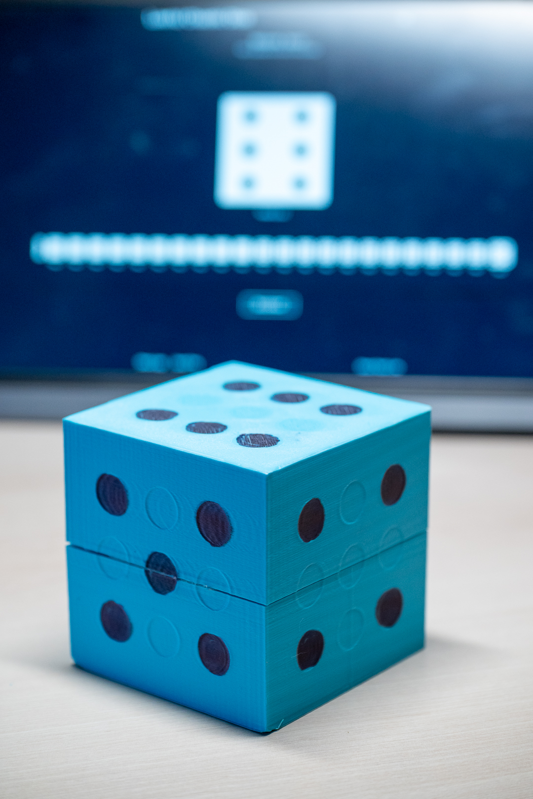
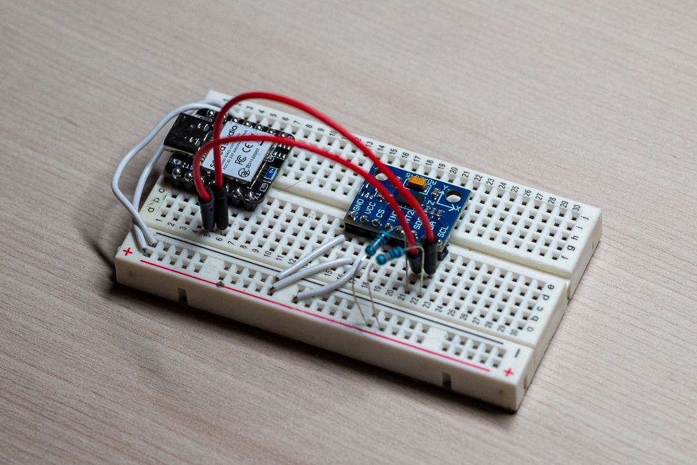
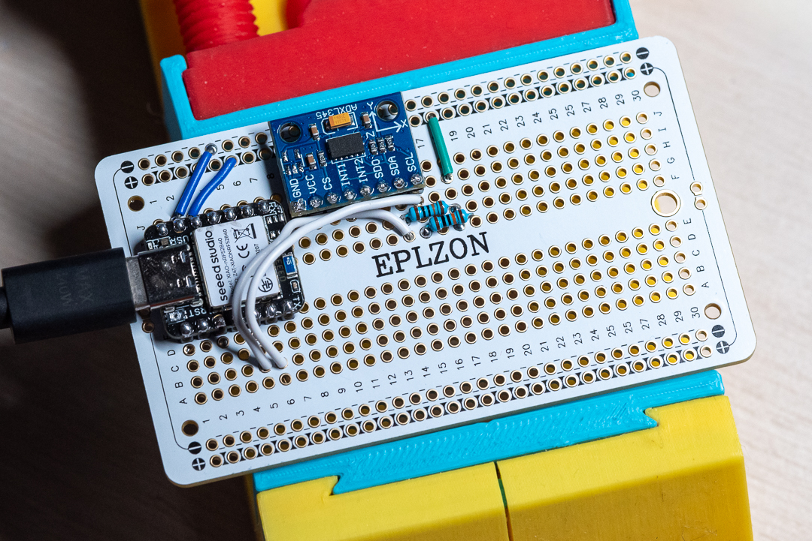

# Dice of Sending

**Wondrous Item, uncommon**

When a Dungeon Master insists you roll in plain sight, the Dice of Sending offer a clever loophole. These enchanted dice are linked by invisible arcane currents (or Bluetooth, depending on your realm’s tech level), allowing a roll in both the physical and digital planes simultaneously.

Those attuned to the Dice of Sending may appear obedient while still indulging their chaotic good nature—rolling fairly, yet unpredictably.

# Quick Start

Full setup below.

1. Solder Seed Studio, battery, and accelerometer together.
1. Calibrate dice with `arduino/calibration/calibration.ino`
1. Add calibration values to `arduino/dice_of_sending/dice_of_sending.ino.
1. Run website with `cd website && npm bootstrap && npm run dev`
1. Open website, connect to dice, start playing board games.

# Setup

## Tools

1. Hot glue gun
1. Soldering iron
1. [Arduino IDE](https://www.arduino.cc/en/software/)

## Parts

1. 1× USB-C cable
1. 1× Seeed Studio XIAO nRF52840
1. 1× ADXL345 accelerometer
1. 1× 3.7V 60mAh 0.22Wh battery
1. 2× 10K resistors
1. PCB wire
1. Eplzon PCB board 89mm × 52mm (You can use a smaller board but will need to design a custom CAD model.)

## Code

- `dice_of_sending/` — Full code with Bluetooth and dice rolling.
- `bluetooth/` — For testing just the Bluetooth communication in isolation. Includes a `bluetooth.html` file for visual help. Open it in your browser, connect, and you should see messages like `Notify: Hello Browser` and `Wrote 'Hello Browser'`.
- `acceleration/` — For testing the accelerometer. Open `Tools → Serial Monitor` to see acceleration outputs.
- `calibration/` — Once fully assembled, use this code to get the acceleration values for each side of the dice. Enter these values into the `faceCalibrations` array in `dice_of_sending/`.

## Circuit

Use the [ADXL345 hookup guide](https://learn.sparkfun.com/tutorials/adxl345-hookup-guide) (I²C wiring diagram, not SPI) and [Seeed Studio XIAO nRF52840](https://wiki.seeedstudio.com/XIAO_BLE/) as references or use the photo below.

You can test the Bluetooth code without the circuit. The accelerometer will require the full circuit.

## Soldering

Don't be like me in the following photo — solder the battery to the Seeed Studio before soldering it to the protoboard. (Photo taken just before I used wire cutters to completely remove the Seeed Studio from the board.)

Ensure the accelerometer PCB is parallel to the protoboard.

## CAD

- STLs can be found in `cad/`.
- Onshape models: [Dice V1 Top](https://cad.onshape.com/documents/4b5c1bf9194b23f57db470b0/w/0611180dab1b4d42950964e7/e/09704a1026edf3dbcc83c50e), [Dice V1 Bottom](https://cad.onshape.com/documents/03b58467c8208d0aa1c9cc45/w/e2a0e9205aa77901d6f0e7f7/e/e3529496a038e29d77a46fd0).

1. Print models.
1. Place circuit inside.
1. Hot glue together. 

## Website

The site may or may not still be hosted [here](https://dice.pointlessprojects.com/).

### Run locally

1. `cd website`
1. [Install Node and npm](https://docs.npmjs.com/downloading-and-installing-node-js-and-npm)
1. Install dependencies — `npm bootstrap`
1. Start website — `npm run dev`

### Deploy

1. Get a domain.
1. Point `website/frontend/src/services/socket.ts` towards your domain. 
1. Build `npm run build` - This will give you an Express server that runs the socket connection and serves the React app.
1. Deploy somewhere.
1. Enjoy!

