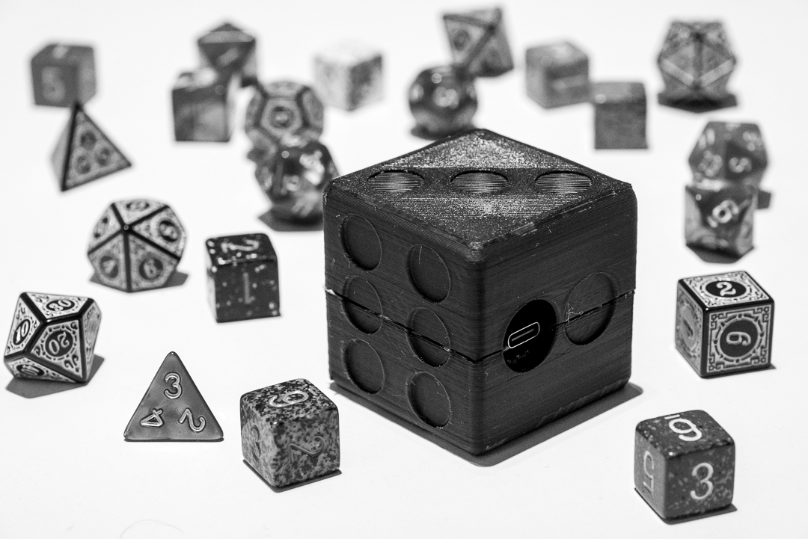
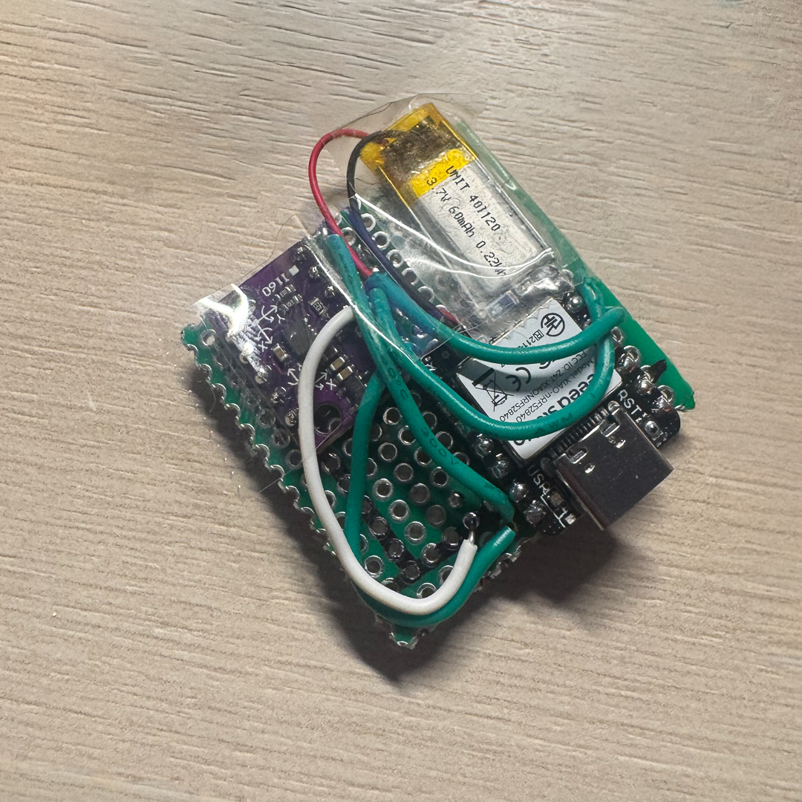

# Dice of Sending



**Wondrous Item, uncommon**

When a Dungeon Master insists you roll in plain sight, the Dice of Sending offer a clever loophole. These enchanted dice are linked by invisible arcane currents (or Bluetooth, depending on your realm’s tech level), allowing a roll in both the physical and digital planes simultaneously.

Those attuned to the Dice of Sending may appear obedient while still indulging their chaotic good nature—rolling fairly, yet unpredictably.

# Preface

This project is still a work in progress and is mostly there but there are still some rough edges.

[Join the discussion on Discord](https://discord.gg/wJ8eyUJk) (Check the `#dice-of-sending` channel).

# Fairness

With the latest version, I test rolled 210 times

- 1 - 34
- 2 - 31
- 3 - 41
- 4 - 37
- 5 - 36
- 6 - 31

# Quick Start

Full setup below.

1. Solder Seed Studio, battery, and accelerometer together.
1. Calibrate dice with `arduino/calibration/calibration.ino`
1. Add calibration values to `arduino/dice_of_sending/dice_of_sending.ino`.
1. Run website with `cd website && npm bootstrap && npm run dev` (Or visit [Dice of Sending](https://dice.pointlessprojects.com/) if still hosted.)
1. Open website, invite friends to a room, connect to dice, start playing board games.

```
const device = await navigator.bluetooth.requestDevice({
    filters: [{ namePrefix: "old-name-here" }],
    optionalServices: ["deadbeef-1234-5678-1234-56789abcdef0"],
});
```

# Future Functionality

These are things I'll maybe do in the future, or you can too!

**Low power mode**

When the dice aren't being rolled, go to sleep to save power.

# Setup

## Tools

1. Hot glue gun
1. Soldering iron
1. [Arduino IDE](https://www.arduino.cc/en/software/)

## Parts

1. 1× `USB-C cable`
1. 1× `Seeed Studio XIAO nRF52840` (Or any Arduino device with Bluetooth)
1. 1× `BMI160 accelerometer + gyroscope`
1. 1× `3.7V 60mAh 0.22Wh battery`
1. 1x 38cm x 38cm Protoboard
1. `PCB wire`

## Code

- `dice_of_sending/` — Final Code.
- `bluetooth/` — Test bluetooth communication. Upload sketch then open the `bluetooth.html` file in the browser.
- `acceleration/` — Test accelerometer. Upload sketch and open `Tools → Serial Monitor` with the Arduino software.
- `calibration/` — Calibrate dice values. Copy output to `dice_of_sending/`.

## Circuit

**References**

- [Seeed Studio XIAO nRF52840](https://wiki.seeedstudio.com/XIAO_BLE/)
- [BMI160 3 Axis Accelerometer & Gyroscope](https://how2electronics.com/interfacing-bmi160-accelerometer-gyroscope-with-arduino/)

## Soldering

1. Solder the battery to the microcontroller pads before soldering the microcontroller to the protoboard.
1. Solder the following connections between the Seeed Studio XIAO nRF52840 and BMI160 using the references above.




## 3D Models

- STLs can be found in `cad/`.
- Onshape models can be found [here](https://cad.onshape.com/documents?nodeId=a9d0374e84dc054d840f8403&resourceType=folder). Use the V2 Models.

1. Print models. I opted for 60% infill. 
1. Place some hot glue on each of the four corners. 
1. Place circuit inside.
1. Place some more hot glue along the edges of the circuit. 
1. Hot glue the two halves together.

## Website

The site may or may not still be hosted [here](https://dice.pointlessprojects.com/).

### Run locally

1. `cd website`
1. [Install Node and npm](https://docs.npmjs.com/downloading-and-installing-node-js-and-npm)
1. Install dependencies — `npm bootstrap`
1. Start website — `npm run dev`

### Deploy

1. Get a domain.
1. Point `website/frontend/src/services/socket.ts` towards your domain.
1. Build `npm run build` - This will give you an Express server that runs the socket connection and serves the React app.
1. Deploy somewhere.
1. Enjoy!

# Known Issues

These are either bugs in the code or quirks/shortcomings.

**Arduino Software can't find device**

Sometimes the device needs to be reconnected a few times before it shows up in Arduino.

**Bluetooth Naming**

It appears that it takes some time for the browser to recognize a name change of `BLE.setLocalName("Arduino");` within the Arduino code. If the device stops showing up and you changed the name, try searching for the old name within the HTML code:
